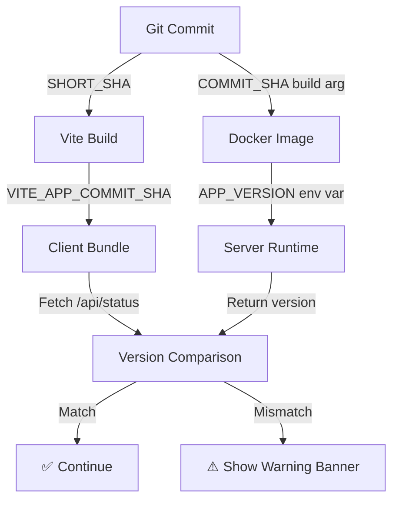

# Version Mismatch Resolution Guide

**Date**: 2025-11-20  
**Repository**: `PriorityLexusVB/vehicle-in-need`  
**Production URL**: `https://pre-order-dealer-exchange-tracker-842946218691.us-west1.run.app/`

---

## Executive Summary

This document explains how version mismatches between client and server are detected, reported, and resolved in the Vehicle-in-Need application. The solution ensures that users are always aware when they're running a stale cached version of the application.

### Problem Statement

**Issue**: Users may load an outdated client bundle from browser cache while the server is running a newer version, resulting in:
- "Version mismatch" warnings in console
- Potential API incompatibilities
- Confusion about which version is deployed
- Unstyled UI if CSS references change between versions

**Root Cause**: Browser caching combined with service workers can cause stale bundles to persist even after server redeployment.

---

## Solution Overview

### Three-Tier Version Validation System



### 1. Build-Time Version Injection

**Vite Configuration** (`vite.config.ts`)
```typescript
// Get git commit SHA and build time
const commitSha = env.VITE_APP_COMMIT_SHA || getGitCommitSha();
const buildTime = env.VITE_APP_BUILD_TIME || getBuildTime();

// Inject into bundle
define: {
  '__APP_VERSION__': JSON.stringify(commitSha),
  '__BUILD_TIME__': JSON.stringify(buildTime),
  'import.meta.env.VITE_APP_COMMIT_SHA': JSON.stringify(commitSha),
  'import.meta.env.VITE_APP_BUILD_TIME': JSON.stringify(buildTime),
}
```

**Docker Build** (`Dockerfile`)
```dockerfile
ARG COMMIT_SHA=unknown
ENV VITE_APP_COMMIT_SHA=$COMMIT_SHA
RUN npm run build

# Runtime stage
ENV APP_VERSION=$COMMIT_SHA
```

**Cloud Build** (`cloudbuild.yaml`)
```yaml
--build-arg COMMIT_SHA=${SHORT_SHA}
--set-env-vars=APP_VERSION=${SHORT_SHA}
```

### 2. Runtime Version Detection

**Client-Side** (`src/main.tsx`)
```typescript
async function logBundleInfo() {
  const commitSha = import.meta.env?.VITE_APP_COMMIT_SHA;
  
  // Fetch server version
  const response = await fetch('/api/status');
  const serverStatus = await response.json();
  
  // Compare versions
  if (commitSha !== serverStatus.version) {
    console.error('❌ VERSION MISMATCH DETECTED');
    console.error(`Client: ${commitSha}, Server: ${serverStatus.version}`);
    showVersionMismatchBanner(commitSha, serverStatus.version);
  }
}
```

**Server-Side** (`server/index.cjs`)
```javascript
app.get("/api/status", (req, res) => {
  res.json({
    version: process.env.APP_VERSION || "unknown",
    buildTime: process.env.BUILD_TIME || "unknown",
    // ...
  });
});
```

### 3. User-Facing Warnings

When a version mismatch is detected, users see a prominent banner:

```
⚠️ Version Mismatch Detected - You may be viewing an outdated version of this app.
Client: abc1234 | Server: def5678
[Hard Reload] [Clear Cache & Reload] [Dismiss]
```

**Banner Features:**
- **Hard Reload**: Forces browser to bypass cache (`location.reload(true)`)
- **Clear Cache & Reload**: Clears all cache storage and service workers, then reloads
- **Dismiss**: Hides banner (version mismatch still logged in console)

---

## Verification Tools

### 1. Version Consistency Check

**Command**: `npm run verify:version`

**What it checks:**
1. ✅ Git repository and current commit SHA
2. ✅ Vite config defines version environment variables
3. ✅ Build output contains version info
4. ✅ Bundle includes version references
5. ✅ Server uses APP_VERSION environment variable
6. ✅ Cloud Build properly tags images
7. ✅ Dockerfile passes version through build stages
8. ✅ Client code can detect version mismatches

**Output:**
```
==================================
Verification Summary
==================================
Passed: 17
Failed: 0
Warnings: 1

✅ All critical checks passed!

Version consistency is properly configured:
  ✅ Git SHA → Vite build → Client bundle
  ✅ Git SHA → Docker build args → Server runtime
  ✅ Client can detect version mismatches with server
  ✅ Cloud Build properly tags images with commit SHA
```

### 2. Production Verification

**Command**: `npm run verify:production`

Comprehensive check of production deployment including version parity.

### 3. Deploy Parity Verification

**Command**: `npm run verify:parity https://pre-order-dealer-exchange-tracker-842946218691.us-west1.run.app/`

Compares local repository version to production deployment.

---

## Deployment Process

### Automatic Deployment (Recommended)

1. **Push to main branch**
   ```bash
   git push origin main
   ```

2. **Cloud Build trigger activates**
   - Builds Docker image with `COMMIT_SHA=${SHORT_SHA}`
   - Tags image with commit SHA
   - Deploys to Cloud Run with `APP_VERSION=${SHORT_SHA}`

3. **Post-deployment verification**
   - Cloud Build verifies CSS is accessible
   - Version info is embedded in both client and server

### Manual Deployment

```bash
# 1. Get current commit SHA
SHORT_SHA=$(git rev-parse --short HEAD)

# 2. Submit to Cloud Build
gcloud builds submit \
  --config=cloudbuild.yaml \
  --substitutions=_REGION=us-west1,_SERVICE=pre-order-dealer-exchange-tracker,SHORT_SHA=$SHORT_SHA

# 3. Verify version consistency
npm run verify:version

# 4. Check production
curl https://pre-order-dealer-exchange-tracker-842946218691.us-west1.run.app/api/status
```

---

## Troubleshooting

### Issue: "Version Mismatch Detected" Banner Appears

**Symptoms:**
- Red banner at top of page
- Console shows client and server versions differ
- Application may work but versions are out of sync

**Diagnosis:**
```javascript
// Check console for:
❌ VERSION MISMATCH DETECTED
Client bundle version: abc1234
Server version: def5678
```

**Solutions:**

1. **Hard Reload** (Try first)
   ```
   Chrome/Edge: Ctrl+Shift+R (Windows/Linux) or Cmd+Shift+R (Mac)
   Firefox: Ctrl+F5 (Windows/Linux) or Cmd+Shift+R (Mac)
   Safari: Cmd+Option+R
   ```

2. **Clear Cache Manually**
   - Open DevTools (F12)
   - Right-click refresh button → "Empty Cache and Hard Reload"

3. **Clear Service Workers**
   - DevTools → Application → Service Workers
   - Click "Unregister" for all registrations
   - Hard reload

4. **Clear All Cache and Storage**
   - DevTools → Application → Storage
   - Click "Clear site data"
   - Reload page

5. **If Issue Persists**
   - Server may need redeployment from latest main
   - Check Cloud Run service version:
     ```bash
     gcloud run services describe pre-order-dealer-exchange-tracker \
       --region=us-west1 \
       --format='value(spec.template.spec.containers[0].image)'
     ```

### Issue: Server Shows "unknown" Version

**Symptoms:**
- `/api/status` returns `version: "unknown"`
- Server logs show `APP_VERSION=unknown`

**Diagnosis:**
```bash
# Check server environment
curl https://pre-order-dealer-exchange-tracker-842946218691.us-west1.run.app/api/status

# Expected:
{
  "version": "abc1234",
  "buildTime": "2025-11-20T...",
  ...
}

# Problem:
{
  "version": "unknown",
  ...
}
```

**Solutions:**

1. **Redeploy with proper version**
   ```bash
   SHORT_SHA=$(git rev-parse --short HEAD)
   gcloud builds submit \
     --config=cloudbuild.yaml \
     --substitutions=_REGION=us-west1,_SERVICE=pre-order-dealer-exchange-tracker,SHORT_SHA=$SHORT_SHA
   ```

2. **Check Cloud Build logs**
   - Verify `COMMIT_SHA` build arg was provided
   - Verify `APP_VERSION` env var was set

3. **Verify Cloud Run environment**
   ```bash
   gcloud run services describe pre-order-dealer-exchange-tracker \
     --region=us-west1 \
     --format='value(spec.template.spec.containers[0].env)'
   ```

### Issue: Client Shows "unknown" or "dev" Version

**Symptoms:**
- Console shows `Version: unknown` or `Version: dev`
- Bundle info indicates version not embedded

**Diagnosis:**
```javascript
// Check console for:
⚠️ STALE_BUNDLE_DETECTED: Version information missing or invalid
```

**Solutions:**

1. **Rebuild locally**
   ```bash
   npm run build
   npm run verify:version
   ```

2. **Check Vite config**
   - Verify `import.meta.env.VITE_APP_COMMIT_SHA` is defined
   - Verify `getGitCommitSha()` function works

3. **Check Docker build**
   - Verify `VITE_APP_COMMIT_SHA` env var is set before `npm run build`
   - Check Dockerfile:
     ```dockerfile
     ENV VITE_APP_COMMIT_SHA=$COMMIT_SHA
     RUN npm run build
     ```

### Issue: CSS Not Loading (Unstyled UI)

**Symptoms:**
- Page loads but appears completely unstyled
- Console shows CSS load failures
- Warning banner appears

**Diagnosis:**
```javascript
// Check console for:
❌ NO CSS FILES LINKED
// OR
❌ CSS LOAD FAILURE: /assets/index-abc123.css
```

**Solutions:**

1. **Verify CSS was built**
   ```bash
   npm run build
   npm run verify:css
   ```

2. **Check Network tab**
   - Look for 404 errors on CSS files
   - Verify CSS file path matches what's in `index.html`

3. **Check server is serving assets**
   ```bash
   curl -I https://pre-order-dealer-exchange-tracker-842946218691.us-west1.run.app/assets/index-abc123.css
   # Should return HTTP/2 200
   ```

4. **Verify Docker image contains CSS**
   ```bash
   # During build:
   docker run --rm <image> ls -la /app/dist/assets/
   # Should show CSS files
   ```

---

## Prevention Mechanisms

### Build-Time Safeguards

1. **CSS Verification** (`npm run postbuild`)
   - Checks CSS files exist
   - Verifies CSS linked in HTML
   - Confirms Tailwind utilities present

2. **Version Consistency** (`npm run verify:version`)
   - Validates version propagation
   - Checks all configuration files
   - Reports failures before deployment

3. **Conflict Detection** (`npm run prebuild`)
   - Fails build if merge conflicts present
   - Prevents accidental deployment of broken code

### Runtime Safeguards

1. **Server CSS Verification** (`server/index.cjs`)
   - Checks CSS files on startup
   - Exits with error if missing
   - Prevents serving broken bundles

2. **Cloud Build CSS Verification** (`cloudbuild.yaml`)
   - Verifies CSS after deployment
   - Fails deployment if CSS not accessible
   - Ensures production always has CSS

3. **Client Version Checks** (`src/main.tsx`)
   - Compares client to server version
   - Warns user of mismatches
   - Provides remediation options

---

## Monitoring and Alerts

### Manual Monitoring

**Check Production Version:**
```bash
# Get server version
curl https://pre-order-dealer-exchange-tracker-842946218691.us-west1.run.app/api/status | jq .version

# Get deployed image tag
gcloud run services describe pre-order-dealer-exchange-tracker \
  --region=us-west1 \
  --format='value(spec.template.spec.containers[0].image)' | grep -o ':[^:]*$'

# Compare to git
git rev-parse --short HEAD
```

**Check for Version Mismatches:**
1. Open production URL in incognito window
2. Open DevTools console
3. Look for version mismatch errors or warnings
4. Verify CSS loads successfully

### Automated Monitoring (Future Enhancement)

Consider adding:
- Cloud Monitoring alerts for version drift
- Synthetic monitoring to detect version mismatches
- Slack/email notifications on deployment
- Automated rollback on health check failures

---

## Best Practices

### For Developers

1. **Always verify version after deployment**
   ```bash
   npm run verify:parity https://pre-order-dealer-exchange-tracker-842946218691.us-west1.run.app/
   ```

2. **Check console logs in incognito mode**
   - Test with fresh cache
   - Verify no version warnings
   - Confirm CSS loads

3. **Use feature branches for changes**
   - Test locally before merging
   - Let CI validate before deployment
   - Review version info in PR

### For Operators

1. **Monitor Cloud Build logs**
   - Watch for CSS verification failures
   - Check version tagging is correct
   - Verify deployment completes

2. **Validate production after deploy**
   - Run `npm run verify:production`
   - Check `/api/status` endpoint
   - Open app in browser and verify styling

3. **Document any manual interventions**
   - If manual deploy was needed, document why
   - Update runbooks if new failure mode discovered
   - Share learnings with team

### For Users

1. **If you see a version mismatch banner:**
   - Click "Clear Cache & Reload" button
   - If that doesn't work, clear browser data
   - Contact support if issue persists

2. **If app appears unstyled:**
   - Hard refresh (Ctrl+Shift+R)
   - Check DevTools console for errors
   - Report issue with console output

---

## Related Documentation

- [`docs/CSS_EXECUTION_FINAL.md`](./CSS_EXECUTION_FINAL.md) - Complete CSS verification guide
- [`docs/DEPLOYMENT_RUNBOOK.md`](./DEPLOYMENT_RUNBOOK.md) - Deployment procedures
- [`DEPLOYMENT_GUIDE.md`](../DEPLOYMENT_GUIDE.md) - Quick deployment reference
- [`scripts/verify-version-consistency.sh`](../scripts/verify-version-consistency.sh) - Version verification script
- [`scripts/verify-deploy-parity.cjs`](../scripts/verify-deploy-parity.cjs) - Deploy parity checker

---

## Summary

### What Was Fixed

✅ **Version Mismatch Detection**
- Client now compares its version to server version on load
- Detailed error logging when mismatch detected
- User-facing banner with remediation options

✅ **Verification Tooling**
- New `npm run verify:version` script
- 17-point validation of version consistency
- Clear pass/fail reporting

✅ **Documentation**
- This guide covers all aspects of version management
- Troubleshooting steps for common issues
- Best practices for developers and operators

### Result

- ✅ Version mismatches are immediately detected and reported
- ✅ Users are informed when running stale cached bundles
- ✅ Clear remediation steps provided in banner and console
- ✅ No silent failures - all version issues are visible
- ✅ Comprehensive verification at every stage of pipeline

### Next Steps

1. **Monitor production** for version mismatch reports
2. **Educate users** on how to clear cache if banner appears
3. **Consider automated alerts** for persistent mismatches
4. **Update CI/CD** to include version verification step

---

**Last Updated**: 2025-11-20  
**Version**: 1.0  
**Author**: Automated analysis and implementation
