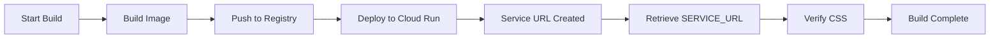

# Cloud Build Trigger Configuration Runbook

## Purpose

This runbook provides step-by-step instructions for operators to diagnose and fix Cloud Build trigger configuration issues, specifically focusing on the SERVICE_URL substitution error that has been recurring in this project.

---

## Quick Reference: The SERVICE_URL Rule

**⚠️ CRITICAL**: `SERVICE_URL` must **NEVER** be configured as a Cloud Build substitution variable (in trigger settings or via `--substitutions` flag).

- ✅ **CORRECT**: SERVICE_URL is a bash variable derived at runtime in `cloudbuild.yaml`
- ❌ **WRONG**: Adding SERVICE_URL to trigger's "Substitution variables" in GCP Console
- ❌ **WRONG**: Including SERVICE_URL in `gcloud builds submit --substitutions=...`

**Why?** The service URL doesn't exist until AFTER Cloud Run deployment completes. It's retrieved dynamically using:

```bash
SERVICE_URL=$(gcloud run services describe ${_SERVICE} --region=${_REGION} --format='value(status.url)')
```

---

## Section 1: Diagnosing Build Failures

### Step 1.1: Identify the Failing Build

When a build fails with a SERVICE_URL error, you'll see:

```
ERROR: (gcloud.builds.submit) INVALID_ARGUMENT: generic::invalid_argument: 
invalid value for 'build.substitutions': key in the template "SERVICE_URL" 
is not a valid built-in substitution
```

**Get the build details:**

```bash
# From Cloud Shell or local terminal with gcloud configured
gcloud builds describe <BUILD_ID> --project=gen-lang-client-0615287333
```

Example:

```bash
gcloud builds describe ec7409ab-9e65-4324-8a49-d6801e5709d5 --project=gen-lang-client-0615287333
```

### Step 1.2: Map Build to Trigger

In the build description output, look for `buildTriggerId`:

```yaml
buildTriggerId: 2255ad51-5b30-4724-89f9-d98b3c3b1dc5
statusDetail: "generic::invalid_argument: invalid value for 'build.substitutions': 
  key in the template \"SERVICE_URL\" is not a valid built-in substitution"
```

**Note the trigger ID** — you'll need it to locate and fix the trigger configuration.

### Step 1.3: List All Triggers (Optional)

To see all triggers in the project:

```bash
gcloud builds triggers list --project=gen-lang-client-0615287333
```

This shows:

- Trigger IDs
- Trigger names
- Repository connections
- Branch filters

---

## Section 2: Locating the Trigger in Cloud Console

### Step 2.1: Navigate to Cloud Build Triggers

1. Open Google Cloud Console: <https://console.cloud.google.com>
2. Select project: **gen-lang-client-0615287333**
3. Navigate to: **Cloud Build → Triggers**
   - Direct link: <https://console.cloud.google.com/cloud-build/triggers?project=gen-lang-client-0615287333>

### Step 2.2: Find the Specific Trigger

- Use the trigger ID from Step 1.2 to locate the trigger
- Common trigger name: `vehicle-in-need-deploy` (but verify with ID)
- Or search by repository: `PriorityLexusVB/vehicle-in-need`

### Step 2.3: View Current Configuration

Click on the trigger name to see:

- **Source**: Connected repository and branch
- **Configuration**: Path to `cloudbuild.yaml`
- **Substitution variables**: The section we need to fix

---

## Section 3: Fixing the Trigger Configuration

### Step 3.1: Edit the Trigger

1. In the trigger details page, click **EDIT** button (top right, pencil icon)
2. Scroll down to the **"Substitution variables"** section

### Step 3.2: Remove Invalid SERVICE_URL Entries

**Look for and remove any of these entries:**

- `SERVICE_URL` (without underscore)
- `_SERVICE_URL` (with underscore)

**Both are invalid** — neither should exist in the trigger configuration.

### Step 3.3: Verify Correct Substitutions

**The trigger should ONLY have these substitution variables:**

| Variable | Example Value | Required? | Notes |
| --- | --- | --- | --- |
| `_REGION` | `us-west1` | Optional* | Deployment region |
| `_SERVICE` | `pre-order-dealer-exchange-tracker` | Optional* | Cloud Run service name |

*These have defaults in `cloudbuild.yaml`, but should be set in trigger for clarity.

**Built-in variables** (automatically provided by Cloud Build, no configuration needed):

- `PROJECT_ID` - GCP project ID
- `SHORT_SHA` - Short commit hash (7 characters)
- `BUILD_ID` - Unique build identifier
- `COMMIT_SHA` - Full commit hash
- `BRANCH_NAME` - Git branch name
- `REPO_NAME` - Repository name

### Step 3.4: Save Changes

1. Review that ONLY `_REGION` and `_SERVICE` are present in substitutions
2. Ensure SERVICE_URL is completely removed
3. Click **SAVE** at the bottom of the page
4. Wait for confirmation: "Trigger updated successfully"

---

## Section 4: Verification

### Step 4.1: Verify Using gcloud CLI

Run the automated verification script from the repository:

```bash
cd ~/vehicle-in-need
./scripts/verify-cloud-build-config.sh
```

**Expected output:**

```
🔍 Verifying Cloud Build trigger configuration...
✅ Authenticated to gcloud
✅ Found trigger: vehicle-in-need-deploy
✅ No SERVICE_URL in substitutions (correct)

Valid substitution variables found:
  ✅ _REGION: us-west1
  ✅ _SERVICE: pre-order-dealer-exchange-tracker

🎉 Cloud Build trigger configuration is valid!
```

**If verification fails**, the script will show specific errors and what needs to be fixed.

### Step 4.2: Test Manual Build

From Cloud Shell or local terminal:

```bash
cd ~/vehicle-in-need
git checkout main
git pull origin main

SHORT_SHA=$(git rev-parse --short HEAD)

gcloud builds submit \
  --config=cloudbuild.yaml \
  --substitutions=_REGION=us-west1,_SERVICE=pre-order-dealer-exchange-tracker,SHORT_SHA=$SHORT_SHA
```

**Important**: Notice we pass `_REGION`, `_SERVICE`, and `SHORT_SHA` but **NOT** `SERVICE_URL`.

### Step 4.3: Monitor Build Progress

The build should proceed through these steps:

1. ✅ Check for conflict markers
2. ✅ Build Docker image
3. ✅ Push image to Artifact Registry
4. ✅ Deploy to Cloud Run
5. ✅ **Verify CSS deployed** ← SERVICE_URL is retrieved here as bash variable

Watch for the verification step output:

```
🔍 Verifying CSS deployment...
Service URL: https://pre-order-dealer-exchange-tracker-842946218691.us-west1.run.app
✅ CSS verification passed!
```

### Step 4.4: Test via GitHub Push

Once manual build succeeds, test the automatic trigger:

```bash
git commit --allow-empty -m "test: verify Cloud Build trigger"
git push origin main
```

Monitor the build in Cloud Console: <https://console.cloud.google.com/cloud-build/builds?project=gen-lang-client-0615287333>

---

## Section 5: Using the List Triggers Script

The repository includes a helper script to inspect all triggers and their substitutions.

### Step 5.1: Run List Triggers Script

```bash
cd ~/vehicle-in-need
./scripts/list-cloud-build-triggers.sh
```

This script will:

- List all Cloud Build triggers in the project
- Show each trigger's substitution variables
- Highlight any triggers with SERVICE_URL configured (these need fixing)

**Example output:**

```
🔍 Listing Cloud Build triggers for project: gen-lang-client-0615287333

Trigger: vehicle-in-need-deploy
  ID: 2255ad51-5b30-4724-89f9-d98b3c3b1dc5
  Repository: github_PriorityLexusVB_vehicle-in-need
  Branch: ^main$
  Substitutions:
    _REGION: us-west1
    _SERVICE: pre-order-dealer-exchange-tracker
  ✅ No SERVICE_URL found (correct)

Summary:
  Total triggers: 1
  ✅ All triggers configured correctly
```

---

## Section 6: Common Mistakes to Avoid

### ❌ Mistake 1: Adding SERVICE_URL to Trigger

**Wrong:**

```yaml
# In Cloud Build trigger configuration
substitutions:
  _REGION: us-west1
  _SERVICE: pre-order-dealer-exchange-tracker
  SERVICE_URL: https://...  # ❌ DO NOT ADD THIS
```

**Right:**

```yaml
# In Cloud Build trigger configuration
substitutions:
  _REGION: us-west1
  _SERVICE: pre-order-dealer-exchange-tracker
  # SERVICE_URL is NOT here - it's derived at runtime
```

### ❌ Mistake 2: Using SERVICE_URL in Manual Builds

**Wrong:**

```bash
gcloud builds submit --config=cloudbuild.yaml \
  --substitutions=_REGION=us-west1,_SERVICE=pre-order-dealer-exchange-tracker,SERVICE_URL=https://...
```

**Right:**

```bash
gcloud builds submit --config=cloudbuild.yaml \
  --substitutions=_REGION=us-west1,_SERVICE=pre-order-dealer-exchange-tracker,SHORT_SHA=$(git rev-parse --short HEAD)
```

### ❌ Mistake 3: Forgetting Underscore Prefix

**Wrong:**

```yaml
substitutions:
  REGION: us-west1      # Missing underscore
  SERVICE: my-service   # Missing underscore
```

**Right:**

```yaml
substitutions:
  _REGION: us-west1     # Underscore prefix for custom variables
  _SERVICE: my-service  # Underscore prefix for custom variables
```

---

## Section 7: Repository Guardrails

This repository has automated checks to prevent SERVICE_URL misconfiguration.

### Automated Check in CI

Every pull request runs:

```bash
npm run lint:cloudbuild
```

This executes `scripts/check-cloudbuild-service-url.sh` which verifies:

- ✅ `cloudbuild.yaml` has no SERVICE_URL in substitutions block
- ✅ No scripts use `--substitutions=SERVICE_URL`
- ✅ No workflows pass SERVICE_URL as substitution

**This check runs in GitHub Actions** — see `.github/workflows/ci.yml`

### Local Verification

Before committing changes, run locally:

```bash
npm run lint:cloudbuild
```

This catches configuration errors before they reach CI or production.

---

## Section 8: Architecture Reference

### How SERVICE_URL Works



**Key point**: SERVICE_URL only exists at step E, after deployment. It cannot be a substitution variable (which must exist before step A).

### Correct Usage in cloudbuild.yaml

```yaml
substitutions:
  _REGION: us-west1
  _SERVICE: pre-order-dealer-exchange-tracker
  # NO SERVICE_URL here

steps:
  # ... build and deploy steps ...
  
  - name: gcr.io/cloud-builders/curl
    id: verify-css-deployed
    waitFor: ['deploy-cloud-run']
    entrypoint: bash
    args:
      - -c
      - |
        # ✅ SERVICE_URL retrieved here as bash variable
        SERVICE_URL=$(gcloud run services describe ${_SERVICE} \
          --region=${_REGION} \
          --format='value(status.url)')
        
        echo "Service URL: $SERVICE_URL"
        # ... rest of verification ...
```

---

## Section 9: Troubleshooting Guide

### Problem: Verification Script Can't Find Trigger

**Symptom:**

```
❌ ERROR: Could not find trigger 'vehicle-in-need-deploy'
```

**Solution:**

```bash
# List all triggers to find the correct name
gcloud builds triggers list --project=gen-lang-client-0615287333

# Update script with correct trigger name if needed
```

### Problem: Permission Denied

**Symptom:**

```
ERROR: (gcloud.builds.triggers.describe) Permission denied
```

**Solution:**

You need one of these IAM roles:

- `roles/cloudbuild.builds.viewer` (read-only)
- `roles/cloudbuild.builds.editor` (read-write)

Request access from project owner or administrator.

### Problem: Build Still Fails After Fix

**Check these:**

1. **Did you save the trigger?** Verify in Cloud Console that changes are saved
2. **Is trigger using correct cloudbuild.yaml?** Check trigger's "Configuration" points to repository's `cloudbuild.yaml`
3. **Are there multiple triggers?** Run `./scripts/list-cloud-build-triggers.sh` to check all triggers
4. **Is it a different error?** Read build logs carefully - may be unrelated to SERVICE_URL

---

## Section 10: Related Documentation

- [CLOUD_BUILD_SERVICE_URL_FIX.md](./CLOUD_BUILD_SERVICE_URL_FIX.md) - Comprehensive SERVICE_URL fix guide
- [cloudbuild.yaml](./cloudbuild.yaml) - Build configuration with detailed comments
- [scripts/check-cloudbuild-service-url.sh](./scripts/check-cloudbuild-service-url.sh) - Static validation script
- [scripts/verify-cloud-build-config.sh](./scripts/verify-cloud-build-config.sh) - Live trigger verification
- [scripts/list-cloud-build-triggers.sh](./scripts/list-cloud-build-triggers.sh) - List all triggers and substitutions
- [GCP_MANUAL_CONFIGURATION_CHECKLIST.md](./GCP_MANUAL_CONFIGURATION_CHECKLIST.md) - Complete GCP setup guide
- [CLOUD_RUN_DEPLOYMENT_RUNBOOK.md](./CLOUD_RUN_DEPLOYMENT_RUNBOOK.md) - Cloud Run deployment procedures

---

## Section 11: Deployment Verification Steps

After a successful deployment, Cloud Build automatically runs two verification steps:

### Step 11.1: CSS Deployment Verification

Verifies that CSS files are:

- Referenced in the deployed HTML
- Accessible via HTTP 200
- Non-trivial size (>1000 bytes)
- Contains Tailwind CSS markers

Script: `scripts/verify-css-deployed.sh`

This step ensures the UI is properly styled in production.

### Step 11.2: Version Verification

Verifies that:

- The `/api/status` endpoint is accessible
- The deployed version matches the commit SHA
- No "manual" or "unknown" versions in production

Script: `scripts/verify-version.sh`

This step ensures version tracking is working correctly.

### Manual Deployment Command

If you need to manually trigger a deployment outside of the trigger:

```bash
cd ~/vehicle-in-need
git checkout main && git pull
gcloud config set project gen-lang-client-0615287333
SHORT_SHA=$(git rev-parse --short HEAD)

gcloud builds submit \
  --config=cloudbuild.yaml \
  --substitutions=_REGION=us-west1,_SERVICE=pre-order-dealer-exchange-tracker,SHORT_SHA=$SHORT_SHA
```

**Service Account Configuration:**

- **Cloud Build SA** (for build/deploy): `cloud-build-deployer@gen-lang-client-0615287333.iam.gserviceaccount.com`
- **Runtime SA** (for Cloud Run): `pre-order-dealer-exchange-860@gen-lang-client-0615287333.iam.gserviceaccount.com`

**Substitution Variables:**

- `_REGION`: `us-west1`
- `_SERVICE`: `pre-order-dealer-exchange-tracker`
- `SHORT_SHA`: Auto-generated from git commit (passed explicitly in manual builds)

---

## Section 12: Quick Command Reference

### Diagnose Failed Build

```bash
gcloud builds describe <BUILD_ID> --project=gen-lang-client-0615287333
```

### List All Triggers

```bash
gcloud builds triggers list --project=gen-lang-client-0615287333
```

### Verify Trigger Configuration

```bash
cd ~/vehicle-in-need
./scripts/verify-cloud-build-config.sh
```

### List Triggers with Substitutions

```bash
cd ~/vehicle-in-need
./scripts/list-cloud-build-triggers.sh
```

### Test Manual Build

```bash
cd ~/vehicle-in-need
git checkout main && git pull
SHORT_SHA=$(git rev-parse --short HEAD)
gcloud builds submit \
  --config=cloudbuild.yaml \
  --substitutions=_REGION=us-west1,_SERVICE=pre-order-dealer-exchange-tracker,SHORT_SHA=$SHORT_SHA
```

### Check Repository Configuration

```bash
cd ~/vehicle-in-need
npm run lint:cloudbuild
```

---

**Last Updated**: 2025-11-22  
**Project**: gen-lang-client-0615287333  
**Service**: pre-order-dealer-exchange-tracker  
**Region**: us-west1
